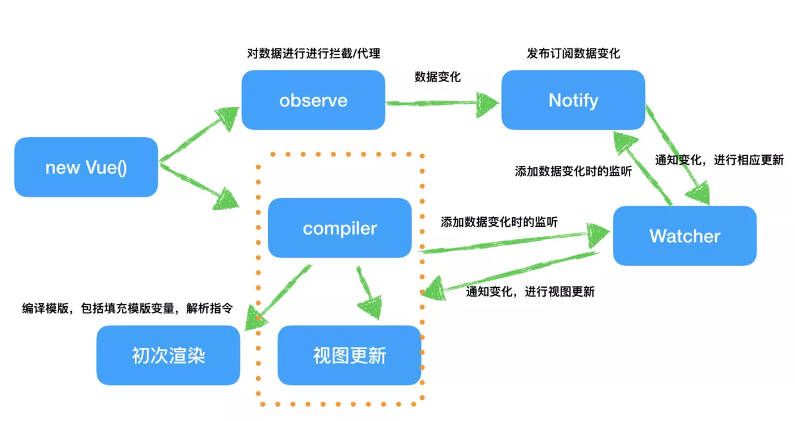

// backup 

1.数据拦截

2.发布订阅模式

3.模板编译


```
整个过程是： 首先对数据进行深度拦截或代理，对每一个属性的getter和setter进行加工，该加工具体做些什么后面马上会有说明。在模板初次编译时，解析指令(如v-model)，并进行依赖收集{{变量}},订阅数据变化。

这里的依赖收集过程具体指：当调用compiler中的replace 方法时，我们会读取数据进行模板变量的替换，这时候“读取数据时”需要做一个标记，用来表示“我依赖这一项数据”，因此我要订阅这个属性值的变化。Vue中定义一个Watcher类来表示观察订阅依赖。这就实现了整套流程，换个思路再复述一遍：我们知道模板编译过程中会读取数据，进而触发数据源属性值的getter，因此上面所说的数据代理的“加工”就是在数据监听的getter中记录这个依赖，同时在setter触发数据变化时，执行依赖对应的相关操作，最终触发模板中数据的变化。
```




<a href='https://www.cnblogs.com/canfoo/p/6891868.html'>邓木琴MVVM</a>

<a href='https://segmentfault.com/a/1190000006599500'>博客园MVVM</a>

